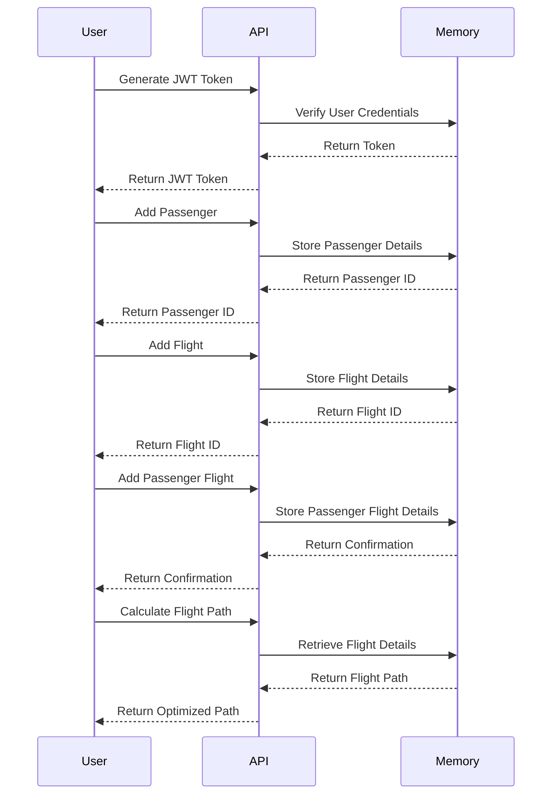
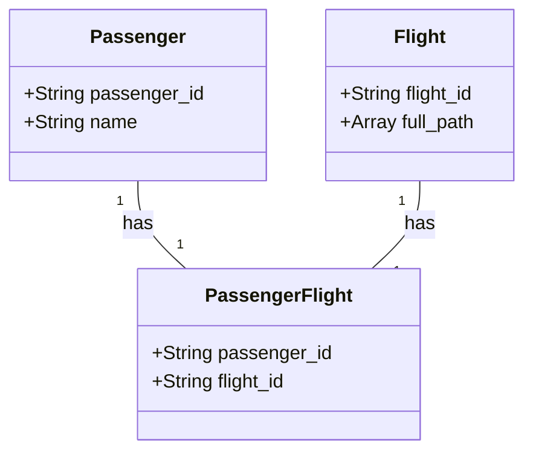

# Flight Path Tracker API

This project provides an API to track flight paths for passengers using Node.js, Express, and JWT for authentication. It also includes Swagger for API documentation.

## Features

- Generate JWT tokens for secure access
- Add passengers and flights
- Associate flights with passengers
- Calculate the flight path for a passenger
- Prevent duplicate passenger names and flight paths
- Swagger UI for API documentation and testing

## Installation

1. Clone the repository:
   ```sh
   git clone https://github.com/RusticRoman/flight-tracker.git
   cd flight-path-tracker
   ```

2. Install dependencies:
   ```sh
   npm install express nanoid swagger-jsdoc swagger-ui-express jsonwebtoken
   ```

3. Run the server:
   ```sh
   node server.mjs
   ```

4. Access the Swagger UI:
   Open your web browser and navigate to `http://localhost:8080/swagger`.

## Usage

### Generate JWT Token

1. Go to the `/v1/token` endpoint in the Swagger UI.
2. Click on the "Try it out" button.
3. Enter the credentials (e.g., `admin` for username and `password` for password).
4. Execute the request to receive the JWT token.

### Add Passenger

1. Use the JWT token obtained from the previous step to authorize in Swagger UI.
2. Go to the `/v1/add_passenger` endpoint.
3. Click on the "Try it out" button.
4. Enter the passenger's name.
5. Execute the request to add the passenger.

### Add Flight

1. Use the JWT token obtained from the previous step to authorize in Swagger UI.
2. Go to the `/v1/add_flight` endpoint.
3. Click on the "Try it out" button.
4. Enter the flight path.
5. Execute the request to add the flight.

### Add Passenger Flight

1. Use the JWT token obtained from the previous step to authorize in Swagger UI.
2. Go to the `/v1/add_passenger_flight` endpoint.
3. Click on the "Try it out" button.
4. Enter the passenger ID and flight ID.
5. Execute the request to associate the flight with the passenger.

### Calculate Flight Path

1. Use the JWT token obtained from the previous step to authorize in Swagger UI.
2. Go to the `/v1/calculate/{passenger_id}` endpoint.
3. Click on the "Try it out" button.
4. Enter the passenger ID.
5. Execute the request to calculate the flight path for the passenger.

## Running Tests

To run the unit tests:

1. Install the dependencies:
   ```sh
   npm install express nanoid swagger-jsdoc swagger-ui-express jsonwebtoken
   ```

2. Run the tests:
   ```sh
   npm test
   ```

## Expected Output

When calculating the flight path, the expected output includes the full path and the optimized path:

```json
{
  "full_path": [
    {
      "leg": ["SEA", "DEN"],
      "flight_id": "abc123"
    },
    {
      "leg": ["DEN", "MIA"],
      "flight_id": "abc123"
    },
    {
      "leg": ["MIA", "LGA"],
      "flight_id": "def456"
    }
  ],
  "optimized_path": [
    ["SEA", "LGA"]
  ]
}
```


## Sequence Diagram






